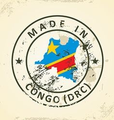

<h1 align="center">
  Made.In.DRC
</h1>

Here is the selection of incredible projects designed by Congolese developers.
<strong>Let's keep on working guys.</strong>

-----------------

<h2 align="center">
  <a href="https://commits.top/congo.html">Most active GitHub users in Congo</a>
</h2>

----------------

  <a href="#A">A</a> | <a href="#B">B</a> | <a href="#C">C</a> | <a href="#D">D</a> | <a href="#E">E</a> | <a href="#F">F</a> | <a href="#G">G</a> | <a href="#H">H</a> | <a href="#I">I</a> | <a href="#J">J</a> | <a href="#K">K</a> | <a href="#L">L</a> | <a href="#M">M</a> | <a href="#N">N</a> | <a href="#O">O</a> | <a href="#P">P</a> | <a href="#Q">Q</a> | <a href="#R">R</a> | <a href="#S">S</a> | <a href="#T">T</a> | <a href="#U">U</a> | <a href="#V">V</a> | <a href="#W">W</a> | <a href="#X">X</a> | <a href="#Y">Y</a> | <a href="#Z">Z</a>

## A

## B

## C

## D

* [Devscast](https://github.com/itotafrica/devscast-backend) - Devcast, le but du projet est de creer une nouvelle facon d'apprendre et de rester informer sur l'evolution de la technologie...  **By [@BernardNgandu](https://twitter.com/bernardngandu)**

## E

## F

## G

## I

## J

## K

## L

## M

## N

## O

## P

## Q

## R

## S

## T

## U

## V

## W

## X

## Y

## Z
